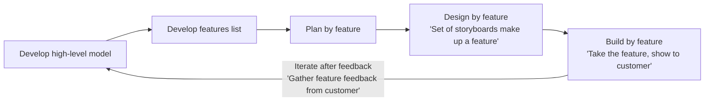

# Agile and Lean Framework

## 📑 Table of Content

### Agile Core Methods: 
1. Scrum
2. Kanban
3. eXtreme Programming (XP)
4. Feature Driven Development (FDD)

### Agile Auxiliary Methods: 
1. Scrum of Scrums
2. Scaled Agile Framework
3. Crystal
4. Behavior Driven Development (BDD)
5. Disciplined Agile (DA)
6. Agile Unified Profess (AUP)
7. Large Scale Scrum (LeSS)
8. Dynamic Systems Delivery Method (DSDM)
9. Enterprise Scrum

------------------------------------------------------------------------------------------------

# Agile Core Methods
## 1. Scrum
- A single team management framework for management product development.
- The Scrum team consists of:
  -  Production Owner = customer, grow user stores for Kanban board
  -  Development Team = Deelops and tests the product. 
  -  Scrum Master = Responsible for ensuring the scrum processes (i.e. standup and retrospectives), removing blockers. 

### Scrum Events and Artifacts Definitions: 

| # | Events |                      Definition                       |
|---|--------| ----------------------------------------------------- | 
| 1 | Sprint | A time-boxed project "iteration" of two to four weeks |
| 2 | Sprint Planning | At the start of each sprint, the scrum team selects the highest priority items. |
| 3 | Daily Scrum | A short (15 minutes) standup meeting to walk through project tasks (often on a Kanban board). |
| 4 | Sprint Review | The development team gives a demo on the product to the product owner for sign-off (or rework or change) |
| 5 | Sprint Retrospective | A retrospective at the end of the sprint, to improve the way of work for the next iteration. |

| # | Artifacts |                      Definition                    |
|---|--------| ----------------------------------------------------- | 
| 1 | Product Backlog | The **product owner** manages a <ins>prioritized list of planned product items</ins> which evolves from sprint to sprint. |
| 2 | Sprint Backlog | The items selected in **Sprint Planning** for the upcoming sprint. |
| 3 | Increments | The Increment is all the Product Backlog items completed uring a Sprint - a step towards the main version or goal. |

------------------------------------------------------------------------------------------------

## 2. Kanban
- "Sign-board"' from the Toyota Production System
- Kanban = Visual Sign in japanese
- It is a form of visual management from Lean manufacturing, for monitoring **Work in Progress**, and enabling "Pull" and "Flow".
- **Pull** is where people or team "pull" work only when they are ready, instead of work or inventory building up.
- **Flow** is where work flows effortlessly through the value chain, with no rework.

### Differences between "Kanban" and "Scrum": 
- Kanban does not prescribe "iterations", but works very well with them (i.e. Scrum).
- It is helpful when you need:
  - increased efficiency
    - Visbility of each task and ensuring it adds value. 
  - Team member focus
    - Limited work in progress allows the team to focus on the current work. 
  - Variability in the workload
  - Reducetion of waste
    - Transparency makes waste visble so it an be removed. 

- The board acts as an **information radiator** to anyone who sees it, providing up-to-date information on the status of work to the team. 

| # | Defining Principles      |   Core properties                                     |
|---|--------------------------| ----------------------------------------------------- | 
| 1 | Start with current state | Visualize the workflow                                |
| 2 | Agree to pursue incremental, evolutionary change | Limit work in progress        |
| 3 | Respect the current process | Manage Flow                                        |
| 4 | Lead at all levels       | Enable "Pull"                                         |
| 5 |                          | Make process policies explicit                        |
| 6 |                          | Implement feedback loops                              |
| 7 |                          | Improve collaboratively                               |

------------------------------------------------------------------------------------------------

## 3. eXtreme Programming (XP)
- a software development method based on frequent cycles, known for poplarizing a lolistic set of 12 primary practices (later expanded to other secondary practices).
- Lightweight, humanistic, discipline, software development.
- Often write tests to test it, Restructure often (see opportunity to improve it), talk to customer often and interact with customer. 

| XP Practice Area | Primary Practices | Secondary Practices |
| ---------------- | ----------------- | -------------------- |
| **Organisational** | Sit together Whole Team Informative workspace | Real customer involvement Team continuity Sustainable pace |
| **Technical** | Pair programming Test-first programming Incremental design | Shared code / collective ownership Documentation from code and tests Refactoring |
| **Planning** | User stories Weekly cycle Quarterly cycle Slack | Root cause analysis Shrinking teams Pay per use Negotiated scope contract Daily stand-ups |
| **Integration** | 10-minute build Continuous Integration Test-first | Single code base Incremental deployment Daily deployment |

### Difference between XP, Kanban, Lean and Scrum

#### More reading about XP: 
https://www.altexsoft.com/blog/extreme-programming-values-principles-and-practices/
Ref: https://www.youtube.com/watch?v=6o6QVDlfaCU&list=PLEWFSKHjyrwy1bYSi1WsoPGDno-LKOnhV&index=17

------------------------------------------------------------------------------------------------

## 4. Feature Driven Development (FDD)
**"Iterative" & "Incremental" method**
- **Iterative** towards success, taking the feedback received, roll back into the product and improve over time --> Scrum, have a designated set of backlog which will be work iteratively over time. Features make up the backlog of work. 
- ""Incremental** Develop products and deliver to customer so customer can touch the products (maybe the features that we can look at) --> Kanban, is the way to manage that work.
   - It started with the backlog. Individual stories make up the features, individual features make up the products

Feature driven development (FDD) is an iterative model for developing software.  It focuses on: 
- Developing an overall model
- Building a features list
- Plan by those features
- Design by those features
- Build by those features

------------------------------------------------------------------------------------------------
# Agile Auxiliary Methods
------------------------------------------------------------------------------------------------
## 1. Scrum of Scrums

- **Scrum of Scrums**
  - Similar to Projects, Programs and Portfolios.
  - Conducted when **two or more teams** of three to nine members need to co-ordinate their work.

- **Attendance**
  - A representative from each team attends a meeting with other team representatives around **three times a week**.

- A represntative from each team attends a meeting with other team representative around 3 times a week, to report on:**
  - Completed work  
  - Next set of work  
  - Current blockers  
  - Potential upcoming blockers  

- **Goal**
  - Ensure teams are coordinating work.
  - Remove blockers across teams.

 ### Relationship with PMBOK Projects, Programs and Portfolios Concept:
Scrum of Scrums aligns well with the view of Projects, Programs, and Portfolios in the PMBOK Guide: 

------------------------------------------------------------------------------------------------

## 2. Scaled Agile Framework (SAFe)

- SAFe focuses on a detailing practices, role and activities at the **portfolio, program and project levels**, and focuses on organizing the enterprise around <ins>value streams that provide value to the customer</ins>. 
- Principles: 
  - Take an economic view
  - Apply systems thinking --> how small piece fit into the bigger piece of the system
  - Assume variability, preserve options
  - Build <ins>incrementally</ins> with fast, integrated learning cycles
  - Base milestones on objective evaluation of working systems
  - <ins>Visualize</ins> and limit work in progress, reduce batch sizes, manage queue lengths --> Kanban Board
  - Apply the cadence for synchronoizing with <ins>cross-domain planning</ins> --> Scrum of Scrums
  - Unlock the <ins>intrinsic motivation</ins> of knowledge workers
  - Decentralize decision making

------------------------------------------------------------------------------------------------

## 3. Crystal 
- This is a general guideline for "communication" and "interaction"
- Introduced by Alexander Cockburn in his book *Crystal Clear* and created at IBM in 1991, Crystal is an agile framework focusing on individuals and their interactions, as opposed to processes and tools (the first Agile principle). It is not a set process, but a guideline for team collaboration and communication.

### Three core beliefs
- Technologies change techniques  
- Cultures change norms  
- Distances change communication  (Prefer to be in the same location)

### Crystal Core values and Properties
- Crystal is designed to scale and recognises that each project may require a **slightly tailored** set of practices based on size and complexity.

| Core Values     | Common Properties                                                            |
| --------------- | ---------------------------------------------------------------------------- |
| People          | Frequent delivery                                                            |
| Interaction     | Reflective improvement (Retrospective, taking feedback back to Scrum, 2-4 wks)|
| Community       | Close communication                                                          |
| Skills          | Personal safety                                                              |
| Talents         | Focus                                                                        |
| Communications  | Easy access to expert users   (Through Product Owner)                        |
|                 | Technical environment with automated tests, configuration management and frequent integration |

### Crystal is designed to scale
Crystal is designed to scale and realises that each project may require a slightly tailored set of practices based on size and complexity.

**Sizing framework**

| Category                 | Crystal clear (1–4 people) | Crystal yellow (6–20 people) | Crystal orange (20–40 people) | Crystal red (5–100 people) |
| ------------------------ | ------------------------------ | --------------------------------- | --------------------------------- | ------------------------------ |
| Life (L)                 | L3                             | L10                               | L30                               | L80                             |
| Essential Money (E)      | E3                             | E10                               | E30                               | E80                             |
| Discretionary Money (D)  | D3                             | D10                               | D30                               | D80                             |
| Comfort (C)              | C3                             | C10                               | C30                               | C80                             |

------------------------------------------------------------------------------------------------

## 4. Behavior Driven Development (BDD)
- Defining Stories and Features from customer POV
- "Whole team" is involve in this process
- Behaviour-driven development allows a developer to focus on testing the code based on the expected behaviour of the software. It is a method of writing user stories.

Specific behaviour-driven development frameworks can be used to define acceptance criteria based on the **given/when/then** format:

- **Given** some initial context,  
- **When** an event occurs,  
- **Then** ensure some outcomes.

------------------------------------------------------------------------------------------------

## 5. Disciplined Agile (DA)
- Disciplined Agile is a process decision framework that blends various Aile techniques based on teh following principles:
- Looking for Results over Process

| Principle                 | Description                                                         |
| ------------------------- | ------------------------------------------------------------------- |
| People First              | Enumerating roles and organisation elements at various levels       |
| Learning-oriented         | Encouraging collaborative improvement                               |
| Full delivery life-cycle  | Promoting several fit-for-purpose life cycles                       |
| Goal-driven               | Tailoring **processes** to achieve specific **outcomes**            |
| Enterprise awareness      | Offering guidance on **cross-departmental** governance              |
| Scalable                  | Covering multiple dimensions of program complexity                  |
 
------------------------------------------------------------------------------------------------

## 6. Agile Unified Profess (AUP)

The intent of AUP is to perform more iterative cycles across seven key disciplines, and incorporate the associated feedback before formal delivery.

| Discipline within a release | Principles guiding the disciplines           |
| --------------------------- | -------------------------------------------- |
| Model                       | The team knows what it’s doing               |
| Implementation              | Simplicity                                   |
| Test                        | Agility                                      |
| Deployment                  | Focus on high-value activities (prioritizing backlog) | 
| Configuration management    | Tool independence                            |
| Project Management          | Tailoring to fit                             |
| Environment                 | Situationally specific                       |

------------------------------------------------------------------------------------------------

## 7. Large Scale Scrum (LeSS)
- LeSS aims to organize several development teams towards a common goal by extending the Scrum method across teams.

| Similarities of LeSS and Scrum                                      | LeSS Techniques Added to Scrum                                                   |
| ------------------------------------------------------------------- | -------------------------------------------------------------------------------- |
| One single product backlog                                          | Sprint planning is more formally divided into two parts – what and how.         |
| One definition of done for all teams                                | Organic cross-team coordination                                                  |
| One potentially shippable product increment at the end of each sprint | Overall cross-team refinement                                                   |
| One product owner                                                   | Overall retrospective focused on cross-team improvements                        |
| Complete, cross-functional teams                                    |                                                                                  |
| One sprint                                                          |                                                                                  |
------------------------------------------------------------------------------------------------

## 8. Dynamic Systems Delivery Method (DSDM)

- DSDM was designed to add more rigour to the rising iterative methods of the 1990s. It is most known for its emphasis on constraint-driven delivery, which sets Cost, Quality and Time at the beginning, then uses formalised prioritisation of scope to meet those constraints.

.png)

### Eight Principles of DSDM framework:

1. Focus on the business need  - deliver products every 2-4 weeks to customer
2. Deliver on time  
3. Collaborate  
4. Never compromise quality  
5. Build **incrementally** from firm foundations  
6. Develop **iteratively**  --> Customer can see what's going on 
7. Communicate continuously and early  (Agile Daily Standup)
8. **Demonstrate control** (use appropriate techniques, prioritisation of scope, etc)  --> Make sure customer can see it. 

------------------------------------------------------------------------------------------------

## 9. Enterprise Scrum

- Enterprise Scrum is a frmework designed to apply the Scrum method **at an organizational level**, not just a single product development effort.
- It advises leaders to:
  - Extend the use of Scrum across all aspects of the organization
  - Generalize the Scrum techniques to apply easily at those various levels
  - Scale the Scrum method with supplemental techniques as necesary

------------------------------------------------------------------------------------------------

