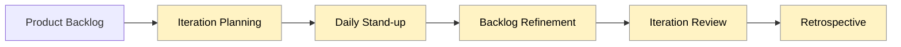

# PMP ECO Topics Overview

| People                                   | Process                         | Business Environment                   |
| ---------------------------------------- | --------------------------------| -------------------------------------- |
| Communication Techniques                 | Predictive Processes            | Be a good steward                     |
| Conflict Management                      | Agile Processes                 | Delivering Value                      |
| Negotiation                              | Project Roles                   | Business Case                         |
| Leadership                               | Political and Cultural Awareness| Benchmarking                          |
| Management                               | Emotional Intelligence          | Alignment with Organizational Goals   |
| Facilitation & Meeting Management        | RAMs and RACIs                  | Prioritization                        |
| Stakeholder Analysis and Engagement      | Five Cs, Push and Pull         | Value Measures                        |
| Team Building and Organizational Theory  | Influencing                    | Compliance & Governance               |
| Brainstorming                            | Team Charter, Way of Work      |                                        |
| Voting                                   |                                  |                                        |
| Tuckman’s Ladder                         |                                  |                                        |

## Topic 1:  People
### Role and Responsibilities

1. Project Sponsors - Initiate the project through project charter, provides funding and / or resources, accepts the project deliverables.
2. Project Manager - Manges the project team to deliver the value
3. Business Analyst - Elicits customer and stakeholder requirements, ensure the solution matches those requirements.  
4. Project Team, Vendor, Seller - perform the work to deliver the value

## Conflict Management

There are 5 general techniques for resolving conflicts:  
1. Withdraw / Avoid
2. Smooth Accomodate
3. Compromise / Reconcile
4. Force / Direct
5. Collaborate / Problem Solve

Incorporating multiple viewpoints and insights from differing perspectives; typically leads to consensus and commitment. This approach can result in a win-win situation. 

## Negotiation Techniques

| Technique                     | Description |
| ---------------------------- | ----------- |
| **Never Say Yes to the First Offer** | There is often even a little room to move from someone’s opening offer. Ask nicely, with a smile. |
| **Bracketing**               | Open your offer an equal distance from where you want to end up – e.g. if you want 10 resources and they offer 8, say you need 12 (10 is in the middle). |
| **Higher Authority**         | Beware of others using a partner, committee, boss or other “higher authority.” They can say no and make it difficult to get a decision. |
| **Never Split the Difference** | If someone offers to split the difference, their new “offer” is that amount. If you split the difference twice, you have given up more than you intended. |
| **Pivot to Non-Monetary Terms** | Can you offer or negotiate on non-monetary terms, like extra days, other resources, or other inclusions? |
| **Deadlines and Time Pressure** | Always “test” a deadline given – check if it’s really true with a hypothetical statement. 80% of concessions are given in the last 20% of the time. |
| **Position for Acceptance**  | Make it easy for the other person by conceding something (like non-monetary terms) to reduce the impact on their ego so they don’t feel they are “losing.” |

## Types of Leadership

| Leadership Style  | Description                                                                                     |
| ----------------- | ----------------------------------------------------------------------------------------------- |
| **Laissez-faire** | Hands-off approach, allows team to make own decisions                                          |
| **Transactional** | Management by exception, focus on achievements                                                 |
| **Servant leader**| Focuses on others’ growth, learning, development, autonomy, and well-being                     |
| **Transformational** | Inspirational motivation                                                                    |
| **Charismatic**   | High energy, self-confident, holds strong convictions                                          |
| **Interactional** | Combination of transactional, transformational, and charismatic styles                         |

## Management vs Leadership

| **Leadership is…**                                   | **Management is…**                               |
| ---------------------------------------------------- | ------------------------------------------------ |
| Guide and influence with relational power            | Direct using positional power                    |
| Develop and innovate                                 | Maintain and administrate                        |
| Focus on relationships with people                   | Focus on systems and structure                   |
| Inspire trust                                        | Rely on control                                  |
| Long-term vision                                     | Near-term goals                                  |
| What and why                                         | How and when                                     |
| Challenge the status quo                             | Accept the status quo                            |
| Doing the right things                               | Doing things right                               |
| Focus on the horizon                                 | Focus on the bottom line                         |
| Vision, alignment, motivation, inspiration           | Operational issues and problem solving           |

## Facilitation & Meeting Management

**Meeting management includes:**

- Preparing and distributing the agenda  
- Ensuring that a representative for each key stakeholder group is invited  
- Ensuring the meetings start and finish at the published time  
- Staying on topic during the meeting  
- Managing expectations, issues, and conflicts during the meeting  
- Recording actions and assigning people responsible for their completion  

## Power vs Influence

## Motivation
- Motivation is providing a reason for someone to act.

- The project manager needs to be aware of:
  - **Student Syndrome**: people apply themselves only at the last possible moment before a deadline.
  - **Parkinson’s Law**: work expands to fill the time available for its completion.

- Teams are motivated by:
  - Empowering them to participate in decision making  
  - Encouraging them to work independently

## Organizational Theory

**Key theories:**

- Maslow’s Hierarchy of Needs
- Herzberg’s Theory of Motivation
- MacGregor’s Theory X and Theory Y
- Parkinson’s Law

People and team members typically need to meet these needs **from bottom to top** – if the previous level is not met, they can’t achieve the next level.

---

### Maslow’s Hierarchy of Needs (Project Context)

| Level (bottom → top)    | Description / Project Context                                                                 |
| ----------------------- | --------------------------------------------------------------------------------------------- |
| **Physiological Needs** | A comfortable workplace, earning enough to live comfortably.                                  |
| **Safety Needs**        | A safe home and safe employment. Is the team feeling safe?                                    |
| **Love / Belonging**    | Friendship, family, relationships. Does my team feel like they belong?                        |
| **Esteem**              | Self-esteem, confidence, achievement, gaining the respect of others.                          |
| **Self Actualisation**  | Creativity, spontaneity, problem solving, lack of prejudice, and a sense of meaning/purpose. |

Maslow’s Hierarchy of Needs is a psychology model that explains **what motivates people** by arranging human needs in a **priority “pyramid”**. The idea: people must satisfy more basic needs first before they’re strongly motivated by higher-level needs.

1. **Physiological Needs**
   * Basic survival: food, water, sleep, shelter, rest.
   * At work: a livable salary, reasonable hours, being physically comfortable enough to function.

2. **Safety Needs**
   * Security and stability: personal safety, health, job security, predictable environment.
   * At work: safe working conditions, clear policies, stable employment, not fearing sudden firing or harm.

3. **Love / Belonging Needs**
   * Social connection: friendships, family, feeling part of a group.
   * At work: feeling included on the team, good relationships with coworkers, not being isolated or excluded.

4. **Esteem Needs**
   * Respect and recognition: self-confidence, feeling capable, being valued by others.
   * At work: recognition for good performance, opportunities to take responsibility, feeling that your skills are respected.

5. **Self-Actualization Needs**
   * Fulfilling your potential: growth, creativity, purpose, personal development.
   * At work: challenging projects, autonomy, chances to learn, innovate, and do work that feels meaningful.

**Key idea:** if lower levels are not met (e.g., someone feels unsafe or can’t pay rent), it’s much harder for them to care about higher-level goals like recognition or personal growth.

---

### Herzberg’s Theory of Motivation

Herzberg’s Theory of Motivation is also called the **Two-Factor Theory**.
It explains **what makes people satisfied or dissatisfied at work** by splitting causes into two groups:

#### 1. Hygiene Factors (avoid dissatisfaction)

These don’t *motivate* people, but if they’re missing or bad, people become unhappy.

Typical hygiene factors:

* Salary and benefits
* Company policies and administration
* Working conditions (environment, tools, facilities)
* Job security
* Relationship with manager and coworkers
* Supervision quality

If hygiene factors are poor → **dissatisfaction**.
If they are good → people feel “not dissatisfied,” but **not necessarily motivated**.

#### 2. Motivators (create satisfaction)

These factors relate to the **work itself** and can truly motivate people and increase job satisfaction.

Typical motivators:
* Achievement
* Recognition for work done
* The work itself (interesting, challenging tasks)
* Responsibility and autonomy
* Advancement / promotion
* Personal growth and development

If motivators are present → **high satisfaction and motivation**.
If motivators are absent → people may feel neutral or bored, but not automatically “angry.”

---
 How this is used in project / people management
* First, **fix hygiene factors** so the team is not distracted or unhappy (fair pay, clear policies, decent tools, reasonable workload).
* Then, **add motivators**: give meaningful work, recognize contributions, increase responsibility, and provide growth opportunities.

So in short:
> **Hygiene factors prevent dissatisfaction; motivators create satisfaction.**

-------------

### MacGregor’s Theory X and Theory Y

McGregor’s Theory X and Theory Y describes **two opposite assumptions managers can hold about people at work**. Those assumptions strongly influence how they lead and control their teams.

---

### Theory X – pessimistic view

Manager’s assumptions:

* People **dislike work** and will avoid it if they can.
* Most people **must be directed, controlled, or coerced** to get them to work hard.
* People **prefer to be told what to do**, avoid responsibility, and want security above all.
* Motivation is mainly through **pay, supervision, and fear of punishment**.

Typical management style:

* Tight control and supervision
* Detailed rules, procedures, and micromanagement
* Little trust or delegation

---

### Theory Y – optimistic view

Manager’s assumptions:
* Work can be **as natural as play or rest** if conditions are right.
* People will **self-direct** and **self-control** when they are committed to objectives.
* Many people **seek responsibility** and want to contribute and grow.
* Creativity, imagination, and problem-solving ability are **widely distributed**, not rare.
* Motivation comes from **intrinsic factors**: achievement, recognition, meaningful work, growth.

Typical management style:
* Delegation and empowerment
* Participation in decision-making
* Focus on creating conditions where people can succeed and develop

#### Why it matters in projects
* A **Theory X** project manager tends to use command-and-control, heavy monitoring, and strict rules.
* A **Theory Y** project manager focuses on enabling, coaching, and trusting the team.

Most modern guidance (including Agile) leans toward **Theory Y** assumptions, especially for knowledge work—but in practice, managers often use a **mix** depending on the situation and team maturity.

---

### Parkinson’s Law
> **“Work expands to fill the time available for its completion.”**

In practice this means:

* If you give a task **2 weeks**, it will usually **take 2 weeks**, even if it could have been done in 3 days.
* People tend to **use up all the time** allocated — adding extra polishing, rework, or delays — simply because the deadline allows it.

### Why it matters for projects

* **Overly generous deadlines** can slow teams down.
* Tasks tend to **grow in complexity** and effort to match the time available.
* To counter it, project managers:

  * Set **realistic but tight deadlines**
  * Break work into **smaller tasks**
  * Use **frequent check-ins** or iterations instead of one far-off due date.

---

### Tuckman's Ladder

Forming --> Storming  --> Norming --> Performing --> Adjorning 

---

### Communication Techniques

Encode --> Transmit message --> Decode 
Feedback / Response <-- Acknowledge

---

### Communication Techniques (5 C's of written communication): 

1. Coherant, logical flow of ideas
2. Correct grammar and spelling
3. Concise expression and elimiation of excess words
4. Clear purpose and expression directed towards the needs of the reader
5. Controlling flow of words and ideas

### Pull & Push Communication 

Pull Communication --> where people can access content at their own discretion. 
Push Communication --> Sent to people who need to receive the information. 

---

Emotional Intelligence: 
1. Self awareness
2. Self management
3. Social awareness
4. Social skills

---

## Politics and Types of Power

| Type of Power    | Using the Type of Power                                        |
| ---------------- | -------------------------------------------------------------- |
| **Positional**   | Using your formal position granted in the team                |
| **Informational**| Using the gathering and distribution of information           |
| **Referent**     | Respect or admiration due to credibility                      |
| **Situational**  | Gained due to a unique situation (e.g., a crisis)             |
| **Personal**     | Using charm and attraction                                    |
| **Relational**   | Using networking and alliances                                |
| **Expert**       | Using skill, experience, and information                      |
| **Reward**       | Giving praise, monetary, or other rewards                     |
| **Coercive**     | Invoking discipline or negative consequences                  |
| **Ingratiating** | Using flattery                                                |
| **Pressure-based** | Limiting freedom or choices                                |
| **Guilt-based**  | Imposing an obligation on others                              |
| **Persuasive**   | Providing the right arguments                                 |
| **Avoiding**     | Refusing to participate                                       |

---

- RAM, RACI
- Team Charter

---

## Process

### Prodictive Processes

#### 49 Project Management Processes

## Agile Process
### 2-Week Iteration / Sprint Flow

Agile: 
- Kanban board
- 3 Amigos - Customers, Developers, Testers
- Iteration Review:  A usable increment or feature should be ready - the team demonstrates this to the customer, who gives feedback and/or approves.
- Retrospective

---

## Business Environment 

### Prioritization 
- Cost / Benefit      BCR = Total Benefit of the project / Cost of the project 
- MoSCoW              M=Must have   S=Should have    C=Could have    W=will not have
- Multi-Voting        3 outcomes:  Unanimity (everyone agrees on the same course of action); Majority (more than 50% of people agree on a course of action); Plurality (the largest block agrees - even if they are not the majority). 
- Kano Analysis       Delighters: provide satisfaction where achieved fully, but do not cause dissatisfaction when not fulfilled.  Satisfers: provide sastisfaction when fulfilled and disatisfaction when not fulfilled.  Basic (when done well, customers are just neutral, but when done poorly, customers are very dissatisfied). 
- Cost of Delay       The cost of delay is the expected value of our feature, per a time period (i.e. weekly).  CD3 prioritize by the value of the item v.s. the time it will take to deliver. 
- WSJF                Weighted Shortest Job first
                      WSJF = Cost of Delay / Job Size
                          Where Cost of Delay is often broken into:
                          - User/Business Value
                          - Time Criticality
                          - Risk Reduction / Opportunity Enablement
                          Job Size is usually:
                          - Story points, effort, or relative size.
                          - You rank work by WSJF score (highest first).

    WSJF = Business Value + Urgency + Risk Reduction = COst of Delay / Job Size
    CD3 – Cost of Delay Divided by Duration
- ICE                  Impact, Confidence, Ease 
- Multi-Criteria Chart  

---

## Value Measures 

1. Net Present Value (NPV)  = the Present Value (PV) of a future stream of payments, minus the Initial Investment Cost

    NPV = [ Total Future Cash Flow / (1 + % Return) ^ Number of time periods ] - Investment

    Investment:         $1000
    Current cash rate:  4% a year
    Cashflow:           $500 a year
    Number of years:    3 years

    NPV = [ $1500 / (1+0.04)^3 ] - $1000
    NPV = $1333 - $1000
    NPV = $333 (greater than zero = good start)

3. Internal Rate of Return  = the restulting return on your investment on given period. The **higher** the IRR the better.
   
   IRR = (Investment) * [ Total Future Cash Flow / (1 + % return) ^ Number of time period ] = 0 

    Investment:         $1000
    IRR:                TBA
    Cashflow:           $400 a year
    Number of years:    3 years

   IRR = [ $1200 / (1 + 0.0626) ^3 ] - $1000 = 0
   IRR = 6.26%
   
5. Return on Investment (ROI)    = a simple ratio that divides the net profit (or loss) from an investmetn by its cost. Because it is expressed as a percentage, it is easy to compare to different project investment choices. 

$2000 - $1000 / $1000 x 100 = 100%
$1500 - $1000 / $1000 x 100 = 50%

6. Payback Period           = payback period is the length of time it takes to breakeven on a project. 
Payback Period = Cost of Project / Average Annual Return 
**The shorter than payback period the better**

7. Benefit-Cost Ratio       = BCR compares the present value of all benefits with that of the cost of a project. 
BCR = Total benefit of the project / Cost of the project

Source: https://www.youtube.com/watch?v=k25eJDUU-J0

