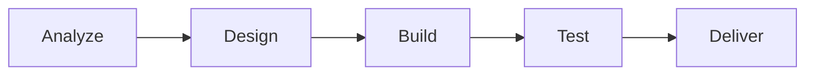
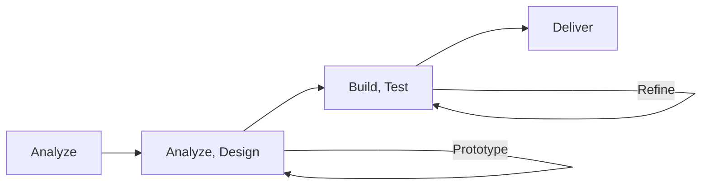
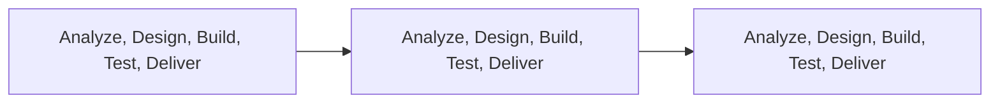
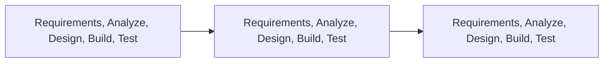

# The Agile Manifesto and Mindset

## 📑 Table of Content

### Key Concepts 
1. The Four Agile Values & Manifesto
2. The Agile 12 Clarifying Principles
3. Life Cycle Selection \
      3a. Predictive / Waterfall \
      3b. Iterative \
      3c. Incremental \
      3d. Agile

### Deep Dive
1. Whole team approach
2. Early and Frequent Feedback
3. Rolling Wave Planning
4. Daily stand-ups
5. Retrospectives
6. Release and Iteration Planning
7. Collaborative User Story Creation
8. Demonstrations / Reviews
9. Continuous Integraiton \
    9b. Agile testing methods
11. Sevant Leadership

### Other topics covereed in PMP Exam:  
10. Life Cycle Selection
11. 

------------------------------------------------------------------------------------------------

## The Four Agile Values & Manifesto

| # |   The Agile Four Values        | over |    Waterfall                 |
|----|-------------------------------| ---- |---------------------------- |
| 1 | Individuals and interactions   | over | Processes and Tools         |
| 2 | Working Software               | over | Comprehensive documentation |
| 3 | Customer collaboration         | over | Contract Negotiation        |
| 4 | Responding to change           | over | Following a Plan            |

The Agile Manifesto argues that although the concepts on the right have value, those on the left have greater value.

## The Agile 12 Clarifying Principles
1. Our highest priority is to satisfy the customer through early and continuous delivery of valuable software.
   2-4 weeks, incremental delivery, put feedback back to the products
2. Welcome changing requirements, even late in development. Agile processes harness change for the customer’s competitive advantage.
   Get regular feedback through iteration, then make changes to the products if necessary intead of one change toward the end.
3. Deliver working software frequently, from a couple of weeks to a couple of months, with a preference to the shorter timescale.
4. Business people and developers must work together daily throughout the project.
5. Build projects around motivated individuals. Give them the environment and support they need, and trust them to get the job done.
6. The most efficient and effective method of conveying information to and within a development team is face-to-face conversation.
7. Working software is the primary measure of progress.
8. Agile processes promote sustainable development. The sponsors, developers, and users should be able to maintain a constant pace indefinitely.
9. Continuous attention to technical excellence and good design enhances agility.
10. Simplicity–the art of maximizing the amount of work not done–is essential.
11. The best architectures, requirements, and designs emerge from self-organizing teams.
12. At regular intervals, the team reflects on how to become more effective, then tunes and adjusts its behavior accordingly.

#### Ref: https://www.youtube.com/watch?v=hnxhqoenoXg&list=PLEWFSKHjyrwy1bYSi1WsoPGDno-LKOnhV&index=4

------------------------------------------------------------------------------------------------

# Life Cycle Selection
Projects come in all shapes and sizes, and there are a variety of ways to manage them. 
- Different organizational structures
- different lifecycles
- different management style
- different sizes
- different customer needs
- different products and outputs

Different types of projects drives different managing methods: 
- Have co-located teams or dispersed teams
- governed by a supportive, controlling or directive PMO, or functional manager
- Sponsor or customer may want daily reports, or weekly reports.
- Have more than one customer group receiving the benefit of the project
- Project may be technically simple or complex
- may have easily definable work, or high uncertainty work. 

# Life Cycle Comparison

| # |   Approach  | Requirements | Activities                               | Delivery                    | Goal                    | 
|---|-------------| ------------ | ---------------------------------------- | --------------------------- | ----------------------- |
| 1 | Predictive  | Fixed        | Performed once for the entire project    | Single Delivery             | Manage Cost             |
| 2 | Iterative   | Dynamics     | Repeated until correct (unfinished work) | Single Delivery          | Correctness of solution |
| 3 | Incremental | Dynamics     | Performed once for a given increment (finished work) | Frequent smaller deliveries | Speed                   |
| 4 | Agile       | Dynamics     | Repeated until correct                   | Frequent smaller deliveries | Customer value via frequent deliveries and feedback | 

## "Predictive" / Waterfall Approach
- The traditional "waterfall" approach, with the bulk of planning done up front, then executing in a single, sequential process. Release products every 2-4 weeks.
#### Predictive Lifecycle Characteristics:
- Take advantage of <ins>high certainty</ins> around requirements, a <ins>stable team</ins>, and <ins>low risk</ins>.
- Project activities often execute in a straight forward, serial manner.
- As the team progresses through the detailed plan, they monitor and control changes that might affect the Scope, Schedule, or Budget (cost).
- Project typically do not dliver business value until the end of project.  

## "Iterative" Life Cycle
- An approach that allows feedback for "unfinished" work to improve and modify that work.
#### Characteristics: 
- Iterative life cycles improve the product or result through successive prototpyes or proof of concepts.  Each new prototype yields new stakeholder feedback and team insights.
- Team may use time-boxing on a given iteration of two or four weeks to build, gather feedback, then put that feedback into the next iteration.
- Useful when complexity is high, or scope is subject to change.
- Iterative life cycles take longer aas they are optimized for learning, rather than speed of delivery.

## "Incremental" Life Cycle
- An approach that provides "finished" deliverables that the customer may be able to use immediately. Release products regularly.
#### Characteristics: 
- When businesses or initiatives cannot afford to wait for everything to be completed.
- In this situation the customer, business, or sponsor are willing to receive a subset of the overall solution delivered in frequent small releases.
- You could provide a single feature at a time.
- Increments are time-boxed in iterative methods, or pulled in flow based methods like Kanban. 

## "Agile" Life Cycle
- An approach that is both iterative and incremental, to refine work items and deliver frequently.
#### Characteristics: 
- In an Agile environment, the team expects requirements to change
- Iterative and Incremental approaches work together - to provide feedback for planning the next iteration, and uncovering hidden or misunderstood requiremetns (using increments)
- For Kanban, or Flow based Agile, it is iterated for the number of features in the Work in Progress (WIP) limit (on the board). The team pulls features from the backlog column on the Kanban board based on their capacity.

## Hybrid Approach
- Projects often combine elements of different life cycles in order to achive their goals.
- A combination of predictive, iterative, incremetnal and agile approaches is hybrid approach.
#### Characteristics: 
- You might have:
      - Largely agile, with some predictive
            - Where you are integrating an external component developed by a different vendor
            - A single iteration might be required after their component is delivered.
      - Predominantly predictive, with some agile components
            - Where you are delivering a straight forward project (a shed or patio), but trialling a new roofing material.
      - A combined predictive and agile approach
            -  A serial or linear project, where tasks are tracked using Kanban and daily scrums are used for updating work. 

------------------------------------------------------------------------------------------------

## Definable Work v.s. High Uncertainty Work
Project work ranges from definable work to high-uncertainty work. 

Definable: Clear procedure, similar to past projects
e.g. Production of a car, appliance or home after the design is complete

High-Uncertainty: High rate of change, complexity and risk
e.g. System or problem solving engineers, product designers, doctors, lawyers etc.

## Project Life Cycle Selection

No Life cycle can be perfect for all projects.  Instead, each project finds a place on the continuum that provides an optimum balance. 

------------------------------------------------------------------------------------------------

### Where does Agile fit in Product and Project Management? 

#### Use "Waterfall" when: 
1. Definable: Clear Procedures, similar to past projects
   i.e. Production of a car, appliance or home after the design is completed
2. High-Uncertainty:  High rates of changes, complexity and risk
   i.e. System or problem solving engineers, product designers, doctors, lawyers

------------------------------------------------------------------------------------------------

# Agile Core Practice

## 1. Whole Team approach
- The whoel team approach meaning involving everyone with the knowledge and skills necessary to ensure project success.
- The team should be "relative small" (successful teams have been observed with as few as three people and as many as nine).
- Ideally, the whole team shared the same workspace / co-located
- Team are often 100% dedlicated to the delivery because when switching or multitasking people make more mistakes adn experience between 20$ - 40% loss of productivity.

### Team Member
1. Cross Functional Team member: consists of team members with all the skills necessary to produce a working product.
2. In SW development, cross functional teams are comprised of designers, developers, testers, and any other required roles.
3. These teams deliver small, releasable products on a regular basis.
4. Thy are critical because they can deliver finished work in shortest possible time, with higher quality, without external dependencies.

### Product Owner
1. The Product Owner respresents the customer
2. Prodcut Owner ≠ Team Lead
3. Respnsible to generates, maintains, and prioritize the product backlog to ensure the highest business value without creating waste.
4. may work with stakeholder, customer and team to define product direction, and rank the work based on its business value. Typically, product owners have a business backgorund and bring deep subject mater expertise to the decisions. 

### Team Facilitator
1. The team facilitator, or servant leader, can be called a project manager, scrum master, project team lead, team coach, or team facilitator.
2. The whole team approach is supported through the daily stand-up meetings, facilitated by this servant leader role.
3. All agile teams need servant leadership on the team, and team members need to build their own servant leadership skills of facilitation, coaching, and removing blockers.

Ref: https://youtu.be/7mMQtDbfzCw?si=TrxXgXWKeZon3DEb

------------------------------------------------------------------------------------------------

## 2. Early and Frequent Feedback
- Agile projects have short iterations enabling the project team to receive early and continuous feedback on product quality throughout the development lifecycle.
- By getting frequency customer feedback as teh project progresses, Agile teams can incorporate most new changes into the product, and the development process.

### The benefit of early and frequency feedback include: 
- Avoid requirements misundersatndings, which may not have been detected until alter in the development cycle when they are more expensive to fix.
- Clarifying customer feature requests, makign them availble for customer use early.  This way, the product better reflects what the customer wants.
- Discovering (via continuous integraiton), isolating, and resolving quality problems early.  Providing information to the Agile team regarding its productivity and ability to deliver.
- Promoting consistent project momentum.

#### Ref: https://youtu.be/qRCs-Th_pWs?si=im32t3ql6LIxk_lr

------------------------------------------------------------------------------------------------

## 3. Rolling Wave Planning
### What is Rolling Wave Planning? 
- Rolling wave planning is an iterative planning technique in which the work to be accomplished in the near term is planned in detail, while work further in the future is planned at a higher level.  They are called the <ins> features</ins>. Afterwards, when it's ready, we will further break down the <ins>features</ins> into <ins>work packages</ins>.
- Rolling wave planning is a form of progressive elaboration applicable to work packages, planning packages, and release planning when using an agile or waterfall approaches.
- Techniques include:
      - Decomposition
      - Iterative scheduling with a backlog 

### Why do we do this? 
- During early strategic planning when information is less defined, work packages may be decomposed to the known level of detail. 
- As more is known about the upcoming events in the near term, work packages can be decomposed into activities. 

#### Ref: https://www.youtube.com/watch?v=PwESbblSdQ0&list=PLEWFSKHjyrwy1bYSi1WsoPGDno-LKOnhV&index=8

------------------------------------------------------------------------------------------------

## 4. Daily Standup
Team use stands up to imcro-commit to each other, uncover and remove blockers, and ensure workflows smoothly through the team. 
- Timeboxed to 15 minutes
- Walk through the Kanban or task board
- Team facilitator / Scrum master or anyone in the team can facilitiate
- Ideally in person, but can be virtual

In Iteration-based agile, everyone answers the following questions in roundrobin fashion: 
- What did I complete since the last stand-up? 
- What am I planning to complete between now and next stand-up? 
- What are my impediments (or risks, blockers, problems)? 

* If problems do arise, take them "offline" - put them in an issue parking lot and don't try and resolve them during the stand-up. 

Ref:  https://www.youtube.com/watch?v=O4K-UKzZfl0&list=PLEWFSKHjyrwy1bYSi1WsoPGDno-LKOnhV&index=10

------------------------------------------------------------------------------------------------

## 5. Retrospectives

Retrospective is a meeting (often held at the end of an iteration of aroudn two weeks) to discuss what was successful, what could be improved, and how to incorporate the improvements and retain the successes in future iterations. 
- What worked well?
- Waht didn't work well?
- What have I learned?
- What still puzzles me? 

------------------------------------------------------------------------------------------------

## 6.  Release Planning v.s. Iteration Planning
- For Agile, there are 2 kinds of planning:  "Release Planning" and "Iteration Planning".

### Release Planning: 
- <ins>Business representatives establish and prioritize the user stories for the release/<ins>, in collaboration with the team, refining larger user stories into a collection of smaller stories.
- BD usually are the business owner
- This process is known as the "Backlog Preparation"

### Backlog Preparation
- The backlog is the ordered list of all the work, presented in "story" form, for a team.
- The facilitator encourages the team to work in triads of a developer, tester, and product owner/business analyst to discuss, write, and then place enough stories into an iternation, and enough features for a first release.

### Iteration Planning
- In iteration planning, the team selects user stories from the prioritized release backlog, elaborates the user stories, performs a risk analysis for the user stories, and estimates the work needed for each user story.
- The number of stories selected is based on established team velocity and the estimated size of the selected user stories.
- <ins>"Velocity"</ins> is the rate a team can complete work (e.g. 16 medium sized cards per iteration)

Ref: https://www.youtube.com/watch?v=lbNS4iy93H8&list=PLEWFSKHjyrwy1bYSi1WsoPGDno-LKOnhV&index=9

------------------------------------------------------------------------------------------------

## 7. Collaborative User Story Creation
- Poor specifications are often a major reason for project failure.
- Agile development, user stories are written with <ins>developers, testers and business representatives</ins>, with freqent informal reviews to ensure they are right.
- A user story:
      - Address both <ins>functional</ins> and <ins>non-functional</ins> requirements
      - Includes <ins>acceptance criteria</ins> for tehse characteristics, which must be:
      - Estimatable, Small, and Testable
      - What is <ins>done</ins> means? 
      - See Behavior Driven Development (Given, when, then)
Ref: https://www.youtube.com/watch?v=O2o1zjiZg04&list=PLEWFSKHjyrwy1bYSi1WsoPGDno-LKOnhV&index=7

### Three C's of User Stories: 
1. Card
2. Conversation
3. Confirmation

------------------------------------------------------------------------------------------------

## 8. Demonstrations / Reviews

- As the team **completed features**, usually **in form of user stories**, the team periodically demonstrates the working product to the **customer/business, and product owner**.
- Often occurs at the end of an **iteration (2 weeks)**, or when enough features have been completed into a set that is coherent. 
- Team members can get feedback that prevents them from heading into wrong directions.  

------------------------------------------------------------------------------------------------

## 9. Continuous Integration
- Delivery of a product <ins>**increment**</ins> require reliable, working, integrated software at the end of every sprint. 
- Continuous integration addresses this challenge by mergin all changes made to the software and integrating all **changed components regularly, at least once a day.**
- Configuration management, compilation, software build, deployment and testing are wrapped into a **single, automated, repeatable process**.  Since developers integrate their work constantly, build constantly, and test constantly, **defects in code are detected more quickly.**  

## 9b. Agile Testing
- Test at all levels
      - Applying **end-to-end testing** and **unit testing (UAT)** (of an individual story or feature). Agile teams have a preference for **automated tests (AT)**.
- Acceptance Test-Driven development (ATDD)
      - Creating end-to-end user acceptance tests by feature, as a team. These tests then feature as reusable "regression tests" for overall functionality, once that feature goes live.
      - **ATDD --> BD, Developer, tester**, all played a role in designing the test criteria and how to test the software. Then built regression test to ensure nothing is broken. 
- Test-Driven Development (TDD( and Behavior Driven Development (BDD)
      - Writing automated tests before writing the product code helps people mistake-proof the product.  For non-software teams, consider prototyping with customer as a test.
      - <ins>**BDD --> Given, When, Then**</ins>
      - Given certain scenario, I want this to happen, then I want that to happen. (from customer POV)
      - <ins>**TDD --> Test first --> Code --> Test**</ins>
      - Write test first --> then write code --> then test should pass afterwards
- Spikes
      - Are timeboxed **research or experiments**.  Use this trying to figure out and estimate **acceptance criteria definition**, or **learning some critical technical** or functional element. 

------------------------------------------------------------------------------------------------

## 10. Servant Leadership

- Agile is a Servant Leaders.  Customer are the team member, and you are the lead. You are here to help them to succeed. 
- Servant leaders approach project work in this order:
   - Purpose: Work with the team to define the "why"
   - People: Creating an environment where everyone can succeed
   - Process:  Look at the results over the process - if a team delivers value often and reflects on the product and the process, it is agile.

------------------------------------------------------------------------------------------------

